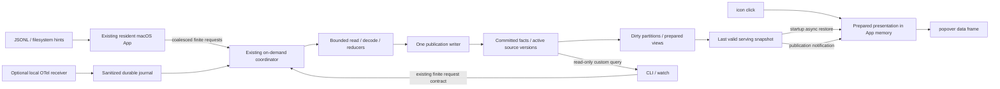

# 展示恢复、事件更新与有界采集

完整契约候选。依赖 [requirements.md](requirements.md)、[菜单栏](ux/menubar.md)、
[CLI](ux/cli.md) 和 [性能决策门](performance-evaluation.md)。不改变现有产品实现。

## 当前代码与改变的位置

源码事实绑定 HEAD `32df0ae1223796f1e43bbd45a40f1efb9f7ff56e`：

| 当前边界 | 已核实事实 | 本设计变化 |
| --- | --- | --- |
| `apps/macos/AgentDeckApp/MenuBarItemController.swift` | `togglePopover` 直接 show，每次重建 hosting controller | 保留直接 show；评估预备视图/复用，禁止把数据更新放进点击路径 |
| `apps/macos/AgentDeckApp/MenuBarViewModel.swift` | 从 coordinator 转 presentation，默认 quota/today/all | 读取已准备的 publication；按 publication+preferences memoize，避免首帧重复投影 |
| `apps/macos/AgentDeckShared/EmbeddedHelperRunner.swift` | coordinator 初始为空；full refresh 先额度，再 host.refresh；扫描 helper 有 timeout | 启动恢复独立；额度 observation、数据更新与首屏解耦；有限请求/订阅语义分开 |
| `internal/desktop/derived_cache.go` | 四类派生值、8 MiB 上限、generation/日期/时区/版本校验 | 保留计算缓存；另建完整、可较旧但身份有效的 serving snapshot |
| `internal/store/derived_generation.go` | core epoch/revision/dirty 与 session epoch | 复用身份；增加 active/build generation 与 serving publication 身份，不能混同来源 cursor |
| `internal/ingest/ingest.go` | metadata discovery、usage/session shared decode、双域 planning、预算和 workers | 分批 planning、chunk 记账、consumer reducer 状态、有界队列与优先调度 |
| `internal/scanruntime/scanruntime.go` | 单协调者、有限 round、receipt、subscriber-only cancellation | 首先复用有限模式；事件合并后提交有限任务；额外常驻能力由收益/持续接收门决定 |
| `cmd/agentdeck/main.go` 与 [CLI Manual](../../specs/cli-manual.md) | scan 同步；stats/summary 有 `--no-scan`，signals 没有 | 共用已提交事实与发布结果；保留当前命令语义，不暗改旧输出 |

CodeGraph 用于关系定位；SQL、Swift 生命周期和磁盘缓存直接核对源码。
运行时耗时仍需 E0/E1，不把这张表当作性能根因证明。

## 按数据是否已经整理选择启动路径

1. **库空：** 一次metadata发现，先排今天日期相关/今天修改的来源，旧活跃会话也纳入。
   第一批usage/session必要事实提交后，生成今天可用视图并发布；继续处理历史。
   目录和mtime只决定优先级，全量inventory保留；覆盖未知时用partial，其他窗口不能声称完整。
2. **已有库：** 有有效展示保存文件就恢复；没有则直接读今天的已提交事实。
   不先调用global scan，也不因现有Presentation同时准备90天/7d/30d而阻塞首批今天视图。
   周/月、工作信号、会话详情按需/后台准备；缺失项目数等显示—而非0。
3. **今天尚未采集：** 旧有效视图先供阅读，增量任务处理新日志。
   可在usage域提交时先查询今天，但实测该域仍可耗时12秒；原样复用管线不保证实时更新。
4. **发布不依赖全局终结：** 采用现有域进度/有限任务能力，在安全提交点产生partial publication。
   Native reader读取不可等待全局worker释放锁；发布文件只对应已提交generation vector。
   历史重算使数据较旧/部分，不使身份仍有效的首批视图消失。

实验的private day-hint过滤仅用于空库对照，绝不能直接移入产品的全局Discover：
已有库遗漏来源可能被解释为删除。产品实现应保留全inventory，分批调度并携带coverage。
CLI显式全范围scan/报告不因App首批今天已经可用而提前返回完整成功。

## 系统结构

第一阶段不新增常驻 Go daemon。已有 macOS App 管理首次当天准备、已有库读取、展示恢复和文件通知，
现有按需 helper 完成有限更新后退出。这能独立检验最小改动的实际收益，
避免把启动恢复、扫描重写、IPC 升级和多进程同时打包而无法归因。

Go workers 已可运行在多 OS threads；当前已有并行，不按核心数增加 workers。
先优化实测显著的会话处理和派生统计，数据一致性通过后再调 worker/分段预算。
默认不启动 parser 子进程，多进程 adoption 必须满足 E3。
OTel 接收必须持续存活，可由显式启用的 App 随行 receiver 满足；这项连续接收需求
与 popover 快开收益分开评估。OTel off 时快开不依赖 receiver。

实施顺序：首次当天/已有库当天准备与快照恢复 → usage增量提交热点及统计分区 → 文件事件合并与 CLI 发布衔接 →
有据的并行预算调整 → 可选 OTel。若 profiler 证明 helper/IPC 占主耗时，才采用下面的常驻扩展。

## 生命周期与所有权

### 默认有限模式

App 持有 watcher/展示订阅；退出停止其事件接收与App-only历史补齐，在有界checkpoint暂停。
为此有限worker也需要记录App作业所有权和暂停策略，不靠关闭popover或取消订阅来推断取消。
CLI已接受的有限义务依既有receipt完成，App退出不能取消它；不改变普通CLI的subscriber-only cancellation。
App 和 CLI 仍只有一个写入协调者。在source/domain安全提交检查点原子发布serving文件，
不等扫描终结。App监听独立publication通知，校验后交换内存；CLI完整请求仍等其有限范围完成。
漏通知在启动/唤醒/明确丢事件提示时有限校对，不用固定刷新周期作为正常更新机制。

首批流程：优先batch的事实和coverage checkpoint提交 → projector读取一致的已提交vector，
将未完成域置unavailable → 校验/原子写serving文件 → 发出publication_ready通知。
usage先提交可先发布，不借旧session值补项目数。后续batch、域或coverage改变可触发新publication；
按publication ID合并，terminal不是首次发布条件。

App新增独立serving订阅/文件变更入口，异步read/decode后绑定可用publication。
此入口不await旧runner的scanIndexes、waitForCompletedScanWorkerToReleaseLock或host.refresh返回。
coordinator接收首批更新latestSnapshot，fullAttempt/scanProgress仍running；
全局terminal结束请求并发布最终coverage。新内部publication通知与外部scan NDJSON v1分开协商，
不能给旧v1流添加未定义事件。漏通知以保存的publication ID有限校对。

### 有条件的常驻扩展

以下 lease/新版 IPC 是保留的扩展设计，不是第一阶段或快开的前置依赖。
只有持续 OTel 接收/多订阅者确需此模式，或相同输入实验证明进程开销值得移除时才启用。

### 扩展：一个 state root，一个协调者

复用私有 state-root identity、现有本地 socket/锁与 receipt 存储。
锁作用域是引擎 writer 的所有权，不是在一个长 round 内持有 SQL transaction。
状态更新以 SQLite 的短事务和 writer 队列串行；maintenance/restore 使用现有维护边界，
先暂停任务和 publication，不能绕过已有扫描/迁移锁。

lease 分三种：

| lease | 创建条件 | 结束条件 |
| --- | --- | --- |
| App | App 启动并成功绑定引擎 | App quit/disconnect；引擎验证 peer/process identity 后回收 |
| independent | 操作者显式 `engine start` | `engine stop` 移除此 lease；不影响仍在运行的 App lease |
| finite task | CLI 的同步 scan/watch 或一次有限刷新 | 请求的 finite work 完成或 watch 显式停止；客户端断连不取消已接受的 scan |

App lease 用受限本地连接和 peer PID/start identity 验证，不用单一 PID 或 actor 名字当身份。
连接关闭触发撤销；App 崩溃必须在 ≤2 秒检测窗口内停止 App-owned watch/new work。
正常退出给予最多 2 秒 checkpoint grace，随后关闭 receiver/watcher。未提交事务 rollback；
已提交 cursor 与 journal 不丢弃，App-owned 重建标为 paused。无需后台模型请求或 OS 登录项。

App quit 时若独立 lease 存在，引擎按操作者选择继续；若只有 CLI 已接受的有限任务，
App resident mode 结束，但按需模式保留该任务直到其契约完成，然后退出。
这是 CLI 自己的工作，不是隐式启用独立后台采集。没有 lease/有限任务时进程退出。
heartbeat 只用于故障诊断，不能每秒唤醒一个空闲 App；本地连接断开与进程终止通知优先。

自动更新偏好控制 JSONL 文件监听；开启后按事件触发，无需用户设定刷新周期，关闭后不偷偷监听/轮询。
启动的一次有限更新、手动刷新、CLI scan 和显式 OTel 接收是各自被授权的来源。
独立 mode 的周期行为使用同一配置，不能凭常驻推导所有采集都默认开启。

### 扩展：IPC 与版本

在现有 private Unix socket 的 handshake 上协商 `protocol_version`、binary/build identity、
state identity 与 capabilities：`serving_read`、`finite_scan`、`publication_subscription`、
`app_lease`、`telemetry_capture`、`telemetry_reconciled`。具体新 protocol 数字在实现时
按现有协议分配；不能复用旧数字承载新语义。外部 scan NDJSON 的 v1 不因内部升级改动。

- 已兼容的引擎：App/CLI attach，不再 launch worker。
- 引擎不存在：App 创建 resident lease；CLI 创建 finite lease，完成后按需退出。
- 旧 v1 worker：旧命令按原 finite_scan 能力使用；App 不声称新快开能力已成立。
- 新 CLI 遇到不兼容引擎：明确 `engine_protocol_mismatch`；只读存储模式仍可使用。
  不擅自 kill、替换或启动第二 writer。升级在任务安全 checkpoint/维护边界显式重启。
- 不同 state root/HOME：不得共享引擎、cache 或 receipts。

IPC 消息均有 size limit、deadline、request ID 与 state ID；只包含任务范围、aggregate
progress、publication ID 和必要结果，不传日志正文或凭据。socket/目录 0700，持久文件 0600，
拒绝 symlink、错误 owner/mode 和不一致 identity。队列超限返回可诊断 busy，不无限内存排队。

## 展示快照契约

### 两种缓存，不混用

`desktop-derived-cache.json` 继续是计算复用缓存：cache hit 要严格匹配计算输入。
新 `desktop-serving-snapshot.json` 是展示恢复文件：包含一次已经验证可显示的完整 payload，
即便更新正在运行也能读取。dirty 或旧 revision 标记其 age/coverage，不直接删去旧文件。

serving header：`format_version`、`wire_version`、`state_identity`、`core_epoch`、
`session_epoch`、`core_schema`、`session_schema`、`publication_id`、`active_generation`、
`usage_revision`、`session_revision`、`projection_version`、`pricing_revision`、
`timezone`、`window_start/end`、`generated_at`、`data_observed_through`、`checksum`。
payload 包含现有各客户端/时段的 usage presentation、provider 展示字段、recent sessions、
work signals、最后的只读 health 观察和 subscription/额度 observations。
不含 credential 值、日志正文、OTel raw bodies。敏感动作不使用 cached provider 为执行真相。

文件上限沿用 8 MiB；超限保留旧有效文件并报告 `serving_payload_limit`，不能静默删行。
常用视图先准备，CLI 任意查询不强迫进入这个文件。必要的 UI 模型封顶沿用已批准规则，
不通过降低数据范围假装达到上限。各 observation 保留自身时间，generated_at 不是 fresh 证明。

发布步骤：构造 prepared payload → 校验完整字段/coverage → 重验 generation vector →
0700 目录内 0600 temporary write → file fsync → atomic rename → directory fsync →
发出 publication notification。新文件验证失败不能替换最后有效快照。
Swift 对一个 immutable publication 原子替换，不能逐字段显示一半新一半旧的 totals/model mix。

### 恢复与 MainActor

App 在显示 status item 的同时，后台做轻量 read-only identity check：core/session 的 epoch/schema
各单行读取，global startup identity deadline 200 ms，SQLite busy timeout 有界。不迁移、不发现日志。
只有身份已验证才恢复缓存；检查超时是身份未知，不能为了 P02 显示来自另一个库的数字。
已运行 App 保留这次 verified identity，不在每次 click 读 SQL。

后台校验、decode、格式化与 prepared-view 构建后，MainActor 只交换 publication/view model。
点击不 await 引擎、helper、disk read 或网络；已经存在的 memory publication 直接 bind。
采用 native signposts 判断 hosting controller 重建是否需要优化，不在缺少测量时重写整个 UI。

无 serving cache但有已提交数据库：优先用今天的indexed read/派生 partitions 构建首批展示，
禁止先扫描日志。完全首次导入：先发布带 unavailable 组的结构，再在来源 chunk 提交后
发布诚实的部分数据。数据恢复完成与一次 global scan 完成是不同事件。
已有usage stats --period today --no-scan在当前语料可约104ms供给基础用量，
但不是完整popover envelope。正式projector需把这些数据接到版本化availability/coverage，
并在后台补其他字段；不能以改CLI输出冒充完整native视图已验收。

### 日期和失效

restore、core/session rebuild、state-root 变化：mint 新 epoch，旧 serving 文件 fail closed。
算法升级或 parser 重算：旧 compatible publication 可继续以 `rebuilding` 显示；新 generation
通过后切换。未来 schema/wire 按原 signal 显示，不将不兼容 payload 解释成较旧可用数据。

跨天/DST/时区变更立即使 date-specific prepared view 失效。先将 today 显示 unavailable，
仍允许查看匹配实际窗口的历史视图；后台基于已存 daily facts 重建新窗口。
不能把昨日 totals 重新贴上今天日期，也不能未采集就给新一天 zero。

## Coverage 与字段供给

展示 wire 新版本增加独立 metadata，不把 freshness、scan state 和完整性合成一个 boolean：

| UX 需要 | 字段与 producer | 规则 |
| --- | --- | --- |
| 可读数据身份 | publication_id + generation vector；projector | 同屏用量、构成和归因来自同一 publication |
| 数据年龄 | generated_at、各组 observed_through；producer | 打开/重试不更新数据时间 |
| 较旧但可用 | freshness=`current/stale`；projector 比较 watermark | stale 可显示，identity invalid 不可显示 |
| 初始/部分/完整 | 每 view/domain coverage=`complete/partial/unknown/unavailable` | `complete` 仅相对声明的 inventory/source set，不代表未启用 OTel 的所有真实消耗 |
| 后台等待/执行/暂停/失败 | job_state + reason_code；scheduler | queue_wait 与 processing 分开；超时退出订阅不改 job_state |
| 历史遗漏 | telemetry coverage intervals + gaps；receiver/reconciler | 无 exporter 时历史=`unknown`，不伪造 gap 起点 |
| 额度年龄与失败 | 现有 subscription observation 时间/status | 与 usage publication 时间独立 |
| 新日不可用 | view.window + coverage；projector | 未知不是 0，旧值不进新窗 |
| CLI 已完成范围 | request receipt.inventory_id/domain watermark | 有限请求可结束，持续实时数据另轮处理 |

wire-v1 helpers/Widget 继续使用既有 envelope，不静默添加会改变旧 client 判断的强制字段。
新 App 请求明确的 serving wire；CLI engine/telemetry status 使用其 command JSON envelope。
v1 的 `desktop snapshot` 仍只读并按原兼容规则返回；它不因 serving miss 自动扫描。
新的 `desktop snapshot --wire-version 2` 是 proposed serving envelope，不是本轮已实现命令。

provider/health/额度各自 observed_at 可不同；其供给不阻塞 usage，但 availability 和日期必须
能独立判读。当前 provider 写入口仍必须 live recheck；额度过期仍显示自己的 stale 状态。
不为不可取得的 OTel root_thread、实际服务模型或 token detail 编造字段。

## 有界调度与 incremental discovery

### 持久来源覆盖与stored-only读取

coverage进入已提交数据库，不只存在于serving header或receipt。
新增inventory_runs（state epoch、有限inventory ID、来源身份/captured end offsets、domain、捕获时点/状态），
source_domain_checkpoints（inventory/source/domain、committed offset/generation、完成/失败/gap），
domain_coverage_heads指向当前已接受inventory及水位。各域在自己的数据库内，把事实与checkpoint/coverage
放在同一提交边界；跨库只读vector，不声明跨库事务。接受新inventory先持久化pending，崩溃不把它改为complete。

stats/summary按client/domain/时间窗读取持久状态：相关完整有限inventory已提交且无失败/gap，
才可对声明水位返回complete；这不证明未导出的OTel数据。未完成来源只有凭可信event-time覆盖证明
才能排除查询窗口，mtime/目录提示不算证明，否则partial。旧库无coverage为unknown，
stored-only不迁移、不发现日志、不启动worker；下一次显式scan可建立证明。
已知新变化未提交为update_pending，旧完整水位与当前freshness分开；unavailable域不造0。
usage complete但session pending时usage-only可完整，session依赖字段仍unknown。

兼容现有v1公共envelope，用source_coverage_partial/source_coverage_unknown/source_update_pending稳定warning
和partial:true表达；与pricing/scan error的partial取OR。text在stderr提示范围/已提交水位，
JSON在stdout保持一个完整envelope、warnings含code，exit0表示读取成功。
DB/coverage读取错误按原错误envelope至stderr、exit1，不返回partial:false成功结果。
只有相关完整inventory及缺口持久提交后才清除来源提示，不靠开关或单一usage结果。
v1不新增强制data字段；wire-v2提供细分coverage；Widget保持其既有兼容契约。
Task2实现coverage及stored-only映射，Task5验CLI/App并发和完成水位。

### 调度与发现

保持实时 ingress、interactive finite requests、历史重建三类队列，但 UI read 不入工作队列。
每个 request 先冻结有限 metadata inventory 和 end offsets；join 只有被已有任务覆盖的
watermark 可复用，否则产生一个有限 follow-up。新事件归下一轮，不移动 CLI 的终点。

历史任务按 source/segment yield。初始加权轮询为实时 4、interactive 2、history 1；
aging 最多 5 秒使 history 获一次时间片，实时流不能饿死历史。每批 planning 先满足
usage/session Plan-or-Skip 并 Seal 后才 read；不等待全目录所有消费者的 planning 才开始首批。
权重是 E2 候选配置，需求里的 resource/latency 硬门禁优先。

持久 manifest 记录 source path 的私有映射、identity、size、mtime/ctime、consumer versions、
cursor、最近有效 event date。文件系统通知只将路径/目录标 dirty。每个 root 保存验证进度，
启动/通知丢失做有限 reconciliation；缺失目录或读取错误不能将所有 source 标删除。
路径移动以既有 source ownership/generation 证明为准，不只按文件名或内容相似认定同一来源。

App 自动更新开启时按文件事件提交增量任务，连续通知做有界合并；启动、唤醒和 watcher
丢事件提示触发有限 reconciliation，不以每分钟轮询作为正常更新路径。关闭时不绕过此偏好。
近期优先用可信 manifest 的 activity，再辅以目录日期/mtime 提示，旧活跃文件必须入队。
Claude 平目录、Codex archived_sessions 和未知日期来源不能被“只扫今天目录”排除。

## 流水线、重读与发布

本节是测量后按需采用的改动边界，不先全盘迁移 facts/schema。
若瓶颈是派生统计，先做下一节的 dirty 分区；若 source reducer 重读/内存主导，
再引入 checkpoint/chunk。每项独立比较完整更新周期，未改善则保留现有实现。

### 实际内存预算

统一 admission 包括 raw bytes、decoded records、usage/session reducer state、writer queue 和
projection 临时值；不要对同一 shared record 重复收费，也不要释放仍被任一 consumer 引用的 bytes。
候选 workers=2，允许 1/2/4/8 的 E2 选择；pool=32 MiB 是 decode/reduce 阶段上限，
总 RSS 满足 256 MiB，不是“32 MiB pool 证明 RSS 32 MiB”。队列长度和字节均有上限。

256 KiB raw chunk，物理行跨 chunk 保持 newline/tail 状态；大行用私有 bounded spill，
长度超上限报告明确 source failure，不无限增长内存。spill 不在正式证据中被引用，
成功或失效后一次清理，崩溃残留按 identity 安全处理。
对 slow consumer backpressure 有界，其他来源仍可调度，不使单一大 source 占满全局预算。

### Consumer checkpoint

`source_identity + generation + parser_version + consumer + byte_offset + newline/tail + reducer_state`
构成 checkpoint。usage 保存累计计数 baseline、模型/provider/session context、turn/source
ownership；session 保存 metadata/FTS/tool reduction 所需上下文。decoder version 与 reducer
version 分开。只有完整物理记录以及该批结果提交后推进 cursor。

append 从 cursor 与已声明校验 anchors 读取；rewrite/truncate/identity 或 parser version
变化创建新 source build generation，不从任意 byte offset 重建累计 token。
无法恢复旧 checkpoint 时该 source 全量 replay，但不扩大成所有日志重读。
Plan 的 union range 与 captured-range validation 保留，不能为速度绕过 source mutation 检查。

### 持久状态与 source 原子性

新增关系以实现时下一个可用 schema version 注册，不预占与其他主题冲突的版本号：

| 关系 | 最小身份/内容 | 原子边界 |
| --- | --- | --- |
| engine_jobs | request ID、scope、inventory、lease owner、cursor、state、reason | 接受任务与 receipt 持久化 |
| source_builds/checkpoints | source identity、active/build generation、consumer offsets/reducer version | 每 chunk 的结果+checkpoint |
| versioned source facts | stable logical event/document ID + source generation + payload | staged generations 对普通查询不可见 |
| source_generation_heads | source + active generation，完整性/consumer watermarks | source 重建完成后 metadata swap |
| derived_partition_state | partition key、input revisions、algorithm/pricing versions、dirty | fact publication 同事务标 dirty |
| serving_publications | generation vector、coverage、file checksum | 已提交投影的可见 publication |
| telemetry_observations/reconciliation | observation key、exact request identity、ownership、state | journal cursor + observation + canonical decision |

现有 canonical event IDs、source ownership、对外字段和 protected tables 不变。
为了 chunk 提交与 rewrite 原子性同时成立，rebuild 必须以 versioned shadow facts + active
source head 发布；不能逐块 delete/replace 正在查询的旧 source。存储 API 的所有相关读路径
显式限定 active generation，旧事实以兼容 base generation 导入。逻辑 ID 与物理版本主键分开，
不让外部事件 ID 因 generation 改变。usage/session 两库各自 source head 原子，不能宣称跨库事务。

迁移需列出直接 SQL readers/writers、FTS、backup/restore、source-removal 和旧客户端影响；
E0 源码影响清单及 L3 migration test 是 implementation 的前置门。不要用数据库 view 魔法
假定所有旧查询自然兼容。若 footprint 或 E2 无法证明收益，回设计缩减 shadow 边界；
不能退回大事务并仍宣称通过 P07。旧 generation 清理不在前台路径，仅清理已不可引用版本。

发布按 source/domain checkpoint 可推进；global scan terminal 仍等请求的有限域完成。
source mutation 导致当前 build 失效则丢弃该 build、保留 active head，有限重试一次，再
返回 `source_changed`，下一轮 reconciliation 继续。禁止无界立即重试。

## 分段统计与 generation 切换

以 UTC event timestamp 存事实；day partitions 明确 timezone/version。late events、跨天
会话和 source correction 标 dirty 的是实际 event 所在 partition，不是文件目录日。
全局/客户端 totals、token/cache/cost 使用 numerator/count，可加指标做 delta；
平均值保存 numerator+denominator，不能平均 daily averages。

distinct sessions/projects、median first-edit、peak、rhythm 和 top-model 不是简单求和：
维护 scoped membership/refcount 或受影响集合 reducer，删除/替换用旧贡献抵消，
全量实现作为 oracle。All 不由可能重叠的 work/auxiliary scoped groups 盲目相加。
未知 pricing 继续未知；价格 revision 变化标 dirty，保留旧价格 provenance，价格规则本身不在本主题重写。

core/session generations 通过 vector 发布。可以公布 usage 已准备、session unavailable 的
partial publication，但依赖 session 的字段不得借旧 revision 声称新完整结果。
当前有效旧完整 publication 一直可读；build 新算法的 shadow partitions 不影响它。
完成差分/约束校验后短事务 swap active generation，再发布 serving；崩溃发生在 swap 后、
文件发布前，下次从 committed generation 恢复发布，不重复事实。
原有 computation cache 与 serving cache 独立失效，避免一个 dirty bit 导致启动全量统计。

## OTel：可选后台来源

官方依据为 [Observability and telemetry](https://learn.chatgpt.com/docs/config-file/config-advanced#observability-and-telemetry)，
本轮已读取：默认 exporter=none；批处理异步并在 shutdown flush；SSE response.completed 有 token counts；
WebSocket 有独立 event。官方页面没有保证本项目需要的所有 exact request identity 与后台 root 关联。
前述 Bug 的本机 0.162.0 隔离实验支持后台 memory token coverage，但没有完成 identity/transport 验收。

### 配置与接收

`telemetry config-preview` 生成供操作者审阅的 Codex `[otel]` 片段和本地 endpoint；
`telemetry enable` 和 Settings 开关只写 AgentDeck 自己的 receiver 配置。两者都不改 `~/.codex/config.toml`。
GUI 字段供给：receiver_enabled 为偏好，listener_state 为运行事实，producer_configured/last_received
为连接观察，metering_capability 为 reconciler 结果；缺失字段保持 unknown，不从开关推出 connected。
producer 配置预览、接收失败后的真实开关状态与停止保留数据由 Settings UX 约束。
producer_configured为true/false/unknown，默认unknown，仅显式可读的脱敏配置检查可赋值。
last_received/最后有效producer事件是独立事实；首次启用/重启无事件显示unknown，
最近有效HTTP事件可显示waiting，但不推出持续连接。仅明确listener/持久化/拒收失败或
可验证producer反馈触发失败/gap；静默不推断未配置或断连，CLI同样保留unknown。
listener 仅绑定 127.0.0.1，动态可配置 loopback port，固定 `/v1/logs`；首版只支持 OTLP/HTTP JSON，
不暗中接受 binary/gRPC。外部接收端仅通过显式 OTel 文件导入，不能读远端凭据或 CPA。
endpoint 与有效 exporter 要由操作者合并；已有 exporter 不会被程序覆盖。
receiver 使用每 state root 随机本地 token（0600 保存），校验 `X-AgentDeck-Token` 后才处理 body；
token 不进入 status、日志、serving cache 或诊断记录。config-preview 默认隐藏，只有显式
`--reveal-local-token` 输出可复制片段；loopback 本身不是来源真实性证明。

允许字段白名单：producer/version、event kind、transport、record timestamp、observed timestamp、
model raw identity、response/request/attempt/thread IDs（存在才收）、明确 source classification、
input/output/cached/cache-write/reasoning token 与 token semantics。拒绝保留 arbitrary attributes/body，
忽略 prompt、tool output、authorization、email、command 内容等，即使 producer 配置失误也不落盘。
collector request body 上限 4 MiB，decode budget 有界；坏格式返回 400，超限 413，
disk/backpressure 不可持久化返回 503。不得先返回成功再异步写盘。

### Journal 与保留

同进程 receiver 只在白名单化记录写入私有 journal 并 fsync 后 ACK；canonical writer 异步消费。
segment 最大 8 MiB，总 journal cap 256 MiB，已成功规范化的 segments 保留 7 天，
达到年龄或 cap 后只清理已确认处理的 segments。未处理数据不因 cap 被静默删去；
无可清理空间则 503 和 local gap diagnostic。SQLite normalized usage facts 按产品既有长期留存，
不会随 journal 清理删除。receipt/journal cursor 与 canonical write 在同事务推进。

上游 Codex batching 不是磁盘队列；receiver ACK 之前的事件可能无法补回。记录实际启用/停止、
接收错误与已知拒收 interval，无法证明完整的时段标 unknown。不把 last_received_at 当作
“这之前全部收齐”。App quit 后 receiver 停止，只有显式 independent engine 才持续接收。
启动时从 journal cursor 恢复，重复 HTTP delivery 可幂等处理；保留周期可显式配置，
变更不追溯制造已不存在的历史记录。

### 去重与源所有权

observation 与 canonical request 分开。观察身份用于 delivery replay；canonical key 优先
`producer instance + exact response_id`，其次经能力验证的稳定 request/attempt identity。
JSONL envelope 的 response_id 与 OTel identity 必须通过隔离生产者实验精确等值核验。
producer instance 的作用域及重启稳定性必须有证据，不能默认 conversation_id 唯一到每请求。

同一 canonical request 只能有一个计量贡献；多个 observations 可以补字段和溯源。
已确认等价时 OTel 提供经 adapter 验证的 usage 与模型观测，JSONL 补历史/thread context；
模型字段保存 raw identity 与 provenance。只有确有生产者返回字段时才标记实际服务模型已知；
配置模型/上下文 model tag 不能直接当成 A/B 服务端实际模型，缺失保持 unknown，交由价格专题处理。
若二者 token 冲突，保留原 canonical contribution、标 conflict，不把较大值当真相。
无 exact match 的重叠观测进入 pending，不相加、不用时间/model/token 猜测合并。
只有经过测试证明的 non-overlap 来源和唯一 request identity 才能单独贡献 canonical usage。

能力状态：`disabled → capture_only → reconciled`。切到 reconciled 需要支持的 Codex 版本、
SSE/WebSocket、normal/memory/guardian、retry/失败/中断及 JSONL 双格式的所有相关测试通过。
未知 producer 版本回到 capture_only，保留 JSONL 既有计量并暴露补采未计入的原因。
token counts 缺失保持 null，input cached/reasoning 是 component，不额外加到 input/output total。
不把每个 SSE event 当调用，不从失败/中断虚构 usage；有明确实际 usage 的记录才进入 reconciliation。
OTLP integer/string number 解码保留整数精度；负值、overflow、cached > input、reasoning > output
或明确 total 与 components 冲突进入 invalid/conflict，不经 float 截断后计量。未知的 detail
保持 null，不能以 0 代替缺失。首版只支持经能力验证的 Codex producer，Claude 仍走 JSONL。

新 source adapter 不改变 pricing 或父子/auxiliary 的展示决策；原始 model/thread/root 均保留
并允许 unknown。与相关 Bug/专题做接口验收，不在这里强行把 unknown memory 归到 guardian。

## 故障、升级与验证

| 故障 | 展示 | 引擎/CLI |
| --- | --- | --- |
| 长重建/排队 | 保留有效快照和真实日期 | job processing/waiting；订阅断开不写失败 |
| engine crash | 已验证 App memory 保留 | receipt/checkpoint 恢复；不双 writer，不重复计量 |
| cache 损坏/身份错 | 无效组 unavailable；既有 schema signal 保留 | readonly bootstrap；diagnostic，不扫描恢复身份 |
| disk full | 保留旧 publication | 事务失败不推进 cursor；receiver 503；显式 gap |
| App quit | 界面关闭 | App lease 终止；独立/CLI 所有权按表处理 |
| parser/算法升级 | 较旧 compatible publication 可读 | shadow 重建，定向 sources/partitions，完成后 swap |
| unknown protocol/schema | 不解释未知数据 | mismatch/fail closed；不得迁移或 kill 其他 worker |
| exporter 停止/上游丢事件 | 已存数据可用，coverage unknown/gap | JSONL 补充，不能补无日志的 memory 历史 |

每项任务的独立验收与 L0–L3 checks 在 [tasks.md](tasks.md)。schema/source-version/backup
必须 full Go regression，concurrency/migration/receiver 必须 race、vet、双 macOS build 与 privacy
fault tests；Swift producer→wire→decode→App 首帧必须有 native 证据。
App 与 CLI 的 logical totals、source identity、FTS、cached reports 和 Widget v1 在同一候选比较。
本轮文档与共享原型是设计证据，尚无上述实现结果或产品 CEv1 VERIFIED。
