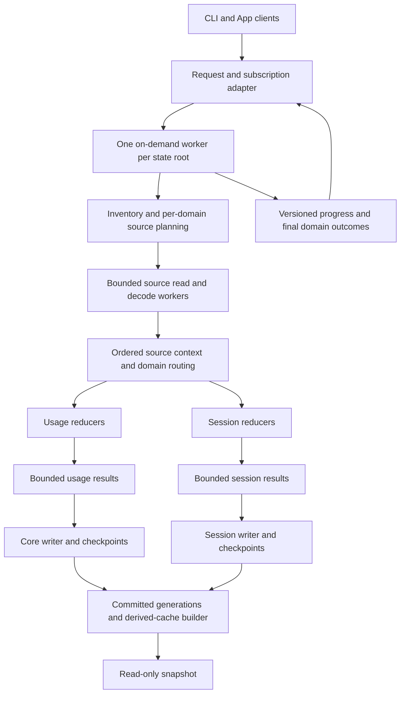

# Snapshot Performance — Worker Scan Development Supplement

## Superseded on 2026-09-10

This file is retained solely as the original design/decision evidence for its
historical review. The user requested a full replan and permitted code replacement.
All operative contracts now live in [requirements](requirements.md),
[architecture](architecture.md) and [tasks](tasks.md). W0-W7 below are historical;
they are not tasks, prerequisites, next commands or a second execution plan.
The original wording below is frozen for provenance, including superseded
preserve-status instructions and authoring-time completion claims.

## 1. Authority, decisions, and status

This is the supplemental development design requested and selected by the user
on 2026-09-10. Subsequent implementation follows this document for unified scan,
worker lifetime, scoped waiting, progress, and the revised optimization route.
It supplements [requirements](requirements.md), [architecture](architecture.md),
and [tasks](tasks.md); it is not a second task or review status authority.

The user selected an on-demand worker and accepted the remaining proposed
behavior: every scan covers usage and session, `--scope` controls foreground
waiting and presentation, callers can rejoin a running task, and only one scan
executes for the same index state. The user explicitly requested preserving the
existing topic document/task status while recording this supplement. Existing
checkboxes and historical review records therefore remain unchanged. They do
not establish review approval, completion evidence, implementation, or native
acceptance for this expanded design. This supplement is drafted, not reviewed;
this documentation request does not start its implementation.

Precedence is explicit:

| Earlier statement | Supplemental disposition |
| --- | --- |
| Separate usage/session scan orchestration | One global scan service; legacy entry points become adapters |
| Scope selects the only domain to execute | Scope selects the domains to wait for and display; both execute |
| Only foreground helper processes | An on-demand detached worker outlives individual callers; no installed permanent daemon |
| Keep every CLI command behavior unchanged | Preserve legacy result schemas; explicitly change scan scheduling to global work with scoped foreground completion |
| No new surface behavior in this topic | Add the agreed scan progress and attach/detach behavior; retain unrelated refresh intervals, Widget policy, and controls |
| Fixed/default reader count or whole-file admission strategy | Measure first; use planned ranges, bounded pipeline ownership and measured concurrency control |
| Existing six-task completion matrix | Preserve as historical/current recorded status; use Section 14 for supplemental execution dependencies and coverage |

For those conflicts, this document governs subsequent implementation. Everything
not expressly changed remains binding: read-only snapshot, exact data semantics,
privacy and retention limits, independent domain outcomes, durability, schema
refusal, and the original performance targets. No release, installation, Git
delivery, background service registration, or production-data benchmark is
authorized by this document. Polling intervals, Widget timelines, quota features,
and unrelated UI redesign remain outside scope.

## 2. Verified starting point and remaining gaps

Source inspection used the topic worktree on `feature/snapshot-performance`,
HEAD `446a58f`, with the retained uncommitted shared-ingestion changes. The
following are locators, not a claim that the future interfaces already exist:

| Current source | Relevant behavior |
| --- | --- |
| [CLI commands](../../../cmd/agentdeck/main.go) | Explicit usage/session scans and implicit scans in usage commands; command state-root resolution |
| [Desktop commands](../../../cmd/agentdeck/desktop.go) | `refreshDesktopIndexes` opens indexes, discovers sources, starts the coordinator and invokes both domain services |
| [Shared ingestion](../../../internal/ingest/ingest.go) | Concurrent root discovery, reader pool, shared decoded batches and independent consumer channels |
| [Usage ingestion](../../../internal/usage/usage.go) | Source registry, cumulative context, append/rewrite handling, ownership and transaction publication |
| [Session ingestion](../../../internal/session/session.go) | Independent source registry, priority, partial lines, approved documents and FTS-related writes |
| [Desktop builder](../../../internal/desktop/desktop.go) | Read-only snapshot composition and request-local aggregation reuse |
| [Helper runner](../../../apps/macos/AgentDeckShared/EmbeddedHelperRunner.swift) | App invokes refresh before snapshot; current process methods return collected output after exit |
| [Popover view](../../../apps/macos/AgentDeckApp/MenuBarSurfaceView.swift) | Existing loading surface and refreshing indicator |
| [View model](../../../apps/macos/AgentDeckApp/MenuBarViewModel.swift) | Presentation of refresh state and prior snapshot |
| [Performance harness](../../../cmd/agentdeck/snapshot_performance_contract_test.go) | Complete refresh/snapshot measurements and logical equivalence checks |

The paths above are relative source links from this topic directory. Inspection
must use current topic sources before editing; the shared CodeGraph index can
describe another worktree and is only a locator in that case.

For the same user, source configuration, and default state root, CLI and App
reuse the same committed indexes under `~/.agentdeck`. An explicit alternate
state root is an isolated index. CLI completion does not itself replace an
already displayed App snapshot. An App refresh currently re-enters both domain
scanners, which decide independently whether to skip, append, or rebuild.
Scanning usage alone does not advance session's registry.

Current shared readers can start before both consumers have decided to skip a
source. Source checks also perform prefix/anchor reads. Shared decoding therefore
does not prove zero reads on unchanged input or literally one physical read of
every byte. Database transactions and usage statement reuse exist; channel
batches are not equivalent to multi-row SQL publication.

The rejected batch-credit experiment in [task history](tasks.md#batch-credit-admission-experiment-rejected--2026-09-10)
is not a starting implementation. Increasing average open readers did not
improve the complete cold cycle. Preserve that rejection; do not restore it
under the assumption that greater concurrency alone solves the bottleneck.

## 3. Terminology and observable command contract

| Term | Meaning |
| --- | --- |
| Cold import | The relevant derived indexes are empty but source logs already exist; not an OS-cache claim or simply opening the App |
| Incremental refresh | Existing indexes process new, appended, rewritten, moved or removed sources and their consequences |
| Unchanged refresh | Source/index eligibility checks pass without new ingestion; statistics may still change with time, prices or other database mutations |
| Worker | A detached local process that owns scan execution and IPC while work exists |
| Round | A finite source-observation and processing boundary with independent domain outcomes |
| Request | One caller's desired observation boundary, scope and subscription |
| Scope | Foreground wait/display selection, never an instruction to omit the other domain |
| Domain completion | Relevant rows, cursor/context and completion checkpoint successfully persisted and input validation satisfied |

New public syntax is `agentdeck scan [--scope usage|session]`; absence of scope
waits for both. Unsupported scope values are input errors before worker launch.
The worker process entry point is internal and is not a second user-facing scan
implementation. Its exact command wiring is chosen during the CLI integration
step and covered by the same service tests.

| Caller | Execution | Foreground completion |
| --- | --- | --- |
| `scan` | Both domains | Both requested domain outcomes are terminal |
| `scan --scope usage` | Both domains | Usage outcome is terminal; session continues if unfinished |
| `scan --scope session` | Both domains | Session outcome is terminal; usage continues if unfinished |
| Legacy `usage scan` | Same global service | Usage only; retain legacy usage result representation |
| Legacy `session scan` | Same global service | Session only; retain legacy session result representation |
| Legacy `desktop refresh-indexes` | Same global service | Both; retain per-domain desktop result/partial conventions |
| CLI implicit scan | Same global service | The command's required domains, followed by its existing query |
| App refresh | Same global service | Both, then read-only snapshot with existing partial/fallback rules |
| `--no-scan` / existing explicitly read-only queries | No worker request | Read existing data only |

Unscoped scan reports a non-success result when a requested domain fails; scoped
scan reports the selected domain's result. The other domain's later failure
cannot retroactively fail an already successful scoped invocation. Legacy
adapters preserve their existing exit/warning/envelope contracts and translate
the service result explicitly. Retained old data never converts a failed scan
into a successful one.

`--quiet` suppresses progress, not requested errors or final machine output.
Existing JSON envelopes remain final-result formats. Introduce an explicit
versioned event-stream mode for the new scan command; do not silently mix
progress into old JSON or snapshot chunk streams. Terminal progress goes to
stderr with final output in the existing destination. No user paths, source
text, tool bodies, or credentials appear in progress.

## 4. Architecture and ownership

The request layer owns waiting, display and detachment. The task layer owns
launch election, round assignment, request coalescing, execution lifetime and
reconnection. The ingestion layer owns source planning, ordering, processing,
publication and recovery. Domain libraries do not spawn worker processes or
recursively request a scan. In-process CLI code invokes the client/service API,
not another public CLI command.

The worker is the only normal global scan orchestrator. Rebuild and other
source-index mutation entry points must join its exclusive execution regime or
wait for it under a documented maintenance barrier. They must not race it as a
second scanner. Non-scan writers retain normal database locking and generation
invalidation. Read-only queries remain available against committed state.

## 5. Worker identity, election, transport and exit

### 5.1 Singleton boundary

The singleton is per canonical state root, not per terminal, domain or App
window. Resolve directory aliases so the same database cannot acquire two scan
owners through different path spellings. Requests also identify the selected
source roots and compatible parser/schema/worker protocol. A request with
different input configuration is not satisfied by the wrong round; serialize
it as a later compatible round or return an explicit configuration conflict.
Different state roots do not share indexes or completion results.

Use an OS-released advisory execution lock held by the worker for its lifetime.
Owner metadata contains a worker-instance nonce, protocol/implementation
identity and diagnostic PID; metadata and PID existence are not lock authority.
Do not kill a process based only on stale PID metadata. The worker owns the
execution lock; clients must release any pre-existing CLI write lock before
requesting or waiting for work.

Concurrent clients may race to launch helper candidates, but only the elected
lock owner initializes execution and publishes a ready endpoint. Losing
candidates exit and clients attach to the owner. A bounded startup handshake
distinguishes absent, starting, ready, draining and incompatible owners. Failure
to connect is not permission to start a second active scan or bypass the lock.

### 5.2 Detached process and local IPC

The selected implementation uses a detached on-demand worker, not a launchd
registration or permanent daemon. Worker stdin is closed/null and stdout/stderr
are independently bounded; no inherited terminal pipe may keep a scoped CLI
alive or terminate the worker when that CLI exits. Verify this with real
subprocess tests, including terminal closure, not only mocked process runners.

Use a private local Unix-domain transport. Authenticate the local peer and bind
the handshake to the canonical state identity and worker nonce. Owner-only
directories/socket access and symlink checks apply. Never accept arbitrary
executable paths or shell commands through IPC. A long state-root path must not
silently fail at the socket pathname limit: use a short owner-only runtime
directory keyed by state-root identity and verify the full identity during
handshake. Cleanup is limited to artifacts proven to belong to this worker or
a dead prior owner while holding election authority.

CLI and bundled App helper may have different versions. Negotiate protocol and
execution-semantic compatibility before joining. Never attach an incompatible
parser/schema request as if it were satisfied. Wait for an incompatible owner
to finish within the caller's deadline, then elect a compatible worker, or
return an explicit incompatibility outcome. Do not hot-replace an active worker
or downgrade databases. Future-schema refusal remains authoritative.

### 5.3 Lifecycle

Worker states are `starting -> accepting/running -> draining -> exited`.
The queue and ownership check decide the draining transition atomically. A
request accepted before draining belongs to the worker; one arriving after the
cutoff receives a retry/redirect outcome and is not acknowledged then forgotten.
Release the endpoint and execution lock in an order that cannot let two scans
overlap. Clients bound reconnect attempts by their request deadline.

The initial request obligates both domains even after its caller detaches. With
no pending work, the worker exits; an optional short reconnect grace must be
bounded and measured, not evolve into permanent polling. Worker timeouts and
per-source error bounds are independent of any one client's timeout. A dead or
stalled client cannot block ingestion, publication or worker shutdown.

Do not introduce automatic infinite retry or scan-until-the-files-stop-changing.
Each accepted round ends in success, partial failure, failure or cancellation.
A later invocation can resume recoverable unfinished work. Worker crashes leave
committed database state authoritative; disappearance of the process is never
reported as successful task completion.

## 6. Requests, rounds, freshness and scoped completion

Each request includes a correlation/idempotency ID, scope, protocol version and
input configuration identity. Each accepted response identifies its assigned
round and observation coverage. This is local coordination metadata, not a
transcript/event store. Maintain a bounded private receipt journal for accepted
round requirements and terminal domain outcomes; source checkpoints in the
databases remain the authority for processed data. Receipt pruning must leave
enough identity to reject or re-evaluate an expired retry instead of replaying
an unknown old success.

Persist acceptance before acknowledging it. Duplicate submissions return the
same accepted requirement or an explicit expired/re-evaluate response. A worker
restart reconciles nonterminal receipts with committed checkpoints, reports the
interruption and resumes/replans when needed. No promise of uninterrupted
service during an OS restart is made.

### 6.1 Finite observation boundary

A request joins the current round only when its completed or upcoming source
observation covers the request. If the relevant inventory has already been
observed, register a coalesced follow-up observation rather than declaring an
old completed domain fresh solely because its status is `completed`.
The follow-up can reuse unchanged signatures and valid domain checkpoints.
Many waiting requests share one pending observation cutoff; a stream of newer
requests cannot move an earlier request's completion boundary indefinitely.

A round records per-source identity/signatures, captured read limits and
per-domain decisions. Directory traversal is not a filesystem transaction.
Files discovered or changed after its observation boundary belong to a later
round; mutations that invalidate bytes being processed fail/replan the affected
source instead of certifying them. Do not advertise a point-in-time atomic
filesystem snapshot.

Rounds execute under one owner without concurrent scan rounds. The current
round's missing domain continues; new observations queue behind that finite
round. This bounds implementation complexity but can make a new usage request
wait behind an earlier session tail. Measure that latency explicitly; do not
promise all future scoped requests bypass unfinished earlier work.

### 6.2 Domain state and foreground result

Each domain transitions through `pending`, `checking`, `processing`,
`committing`, then `completed`, `failed` or `cancelled`. Progress may be
coalesced; terminal outcomes are durable and queryable. Completion requires
rows/cursors/context committed, final validation satisfied and the domain's
completed-input checkpoint persisted. Successfully decoded records or an empty
channel are not completion.

After usage completes, a usage-scoped caller returns while session continues.
A session-scoped caller attaches to the same round when coverage qualifies,
first receives its current state, then subsequent events. App requests both
domains and then runs snapshot. A domain that already completed is not rerun
unless a new observation, invalidation or requested recovery requires it.

Examples to preserve in acceptance tests:

| Situation | Required outcome |
| --- | --- |
| Usage foreground exits while session is pending | Worker continues; no session progress printed to the departed CLI |
| Session caller joins that covered round | Current session progress and eventual committed result; no duplicate execution |
| New input appears after usage completion | New caller is assigned follow-up observation; old usage completion is insufficient |
| Usage succeeds and session fails | Usage receipt remains successful; global/session request sees session failure |
| All clients detach | Both originally requested domains continue to terminal outcomes |
| Worker dies after rows/cursors commit but before receipt completion | Recovery derives truth from checkpoints; no duplicate logical import |

### 6.3 Cancellation and deadlines

Ctrl-C, popover closure, caller timeout and connection loss detach only that
subscriber by default. They do not cancel work needed by other clients or the
initial global scan obligation. Explicit global cancellation is a distinct,
authorized control operation; do not implicitly add a new public cancellation
flag or UI control in this iteration. It must stop scheduling, unwind bounded
queues, roll back incomplete transactions and notify all affected requests.

Keep existing App refresh and snapshot deadline boundaries unless a separate
decision changes them. A timed-out App may still read prior committed indexes
under its existing fallback contract while the worker continues. Its attempt
is not a successful complete-refresh benchmark. Repeated refresh attempts join
existing work rather than terminating and relaunching it.

## 7. Plan first, then perform shared ingestion

### 7.1 Discovery and domain planning

Partition directory traversal by disjoint roots/subdirectories, including dates
where useful, with a bounded work queue. Preserve the original inclusion,
exclusion, symlink and priority rules. A directory enumeration failure does not
prove its previously indexed sources were deleted; suppress removal publication
for incomplete inventories and report the affected domain failure.

Before scheduling source bodies, bulk-load domain registry state and decide
`skip`, `append`, `replace/rebuild`, `move`, or `remove` independently. Inputs
include database epoch, parser/schema compatibility, root selection, identity,
size, mtime, reliable change-time, required mode, anchors, partial lines and
domain-specific context. Legacy signatures that cannot prove eligibility fall
back to validated scans. Cache absence is not an ingestion freshness test.

| Usage plan | Session plan | Shared body plan |
| --- | --- | --- |
| Skip | Skip | No body reader; perform only necessary eligibility checks |
| Append | Skip | Read usage's validated needed range |
| Skip | Full | Read for session only |
| Append | Append | Read union of needed ranges, respecting each domain's resume boundary |
| Full | Full | One shared sequential body/decode pass for this source attempt |

Resume offsets are not interchangeable: usage records complete-line offsets and
stateful context, while session may retain an unfinished suffix. Convert each
domain's requirement to a validated complete-record read boundary and route
records only where required. A naive minimum byte offset can duplicate or lose
partial-line content. Capture bounded source limits and check mutation before
publication; newly observed bytes cannot advance a checkpoint beyond processed
bytes. Validation/anchor reads and retries are explicitly counted separately
from the shared body pass.

### 7.2 Event and ordering contract

Decoded events are immutable while shared. The internal envelope carries source
identity, round, sequence, byte range, parser identity and the approved payload.
Keep decode errors/unknown records consistent with existing supported-input
behavior. Derive only the common context that is semantically identical between
domains; do not merge domain parsers merely because their field names resemble
one another. Preserve machine identity and domain-specific resume state.

Within each source, apply records in original order before distributing work
whose meaning depends on session, cumulative tokens, pending turns or tool
lifecycle. Event timestamps support business aggregation, not replacement of
source sequence. A type channel is not permission to process a completion before
its prerequisite. Cross-source reduction can run concurrently, while duplicate
ownership, active/archive priority and database-dependent associations retain
each domain's independent deterministic publication order.

Avoid a goroutine per record or per event type. Use a small domain/partition
worker set with serial source lanes. A completed reducer result contains only
approved derived data plus the information required for publication validation.
Database-dependent ownership, run binding and cursor assumptions are rechecked
at publication, or are proven stable under the applicable lock. Do not retain a
write transaction while a reducer waits for source/channel input.

### 7.3 Backpressure, ordering and memory ownership

Budget reader buffers, decoded records, reducer state, queued derived results,
reorder buffers and active SQL batches together. Channel capacity alone is not
a memory bound. Shared batches are released only after every participating
consumer relinquishes references; SQL/derived-result ownership then has its own
budget. A skipped/failed domain must release its ownership and never prevent the
other domain from completing.

Give independent bounded result queues to both domains. Dispatch ready work in
an order that can advance each domain's publication head. Reserve progress
capacity for the earliest incomplete source and avoid letting later sources
consume the entire budget. With different domain orders, use approved-derived
spooling only if measurement proves it necessary; never spool raw JSON,
reasoning, unrestricted tool bodies, or credentials. Spool identity, version,
quota, cleanup and error behavior belong to the implementing work package.

Resource exhaustion cannot silently discard the background domain. Stop new
admission or take a bounded single-source path; on unrecoverable resource failure
report that domain's failure. Supported oversized records retain existing
acceptance semantics and use exclusive handling if needed. Report their memory
separately rather than claiming a hard ordinary-buffer bound also covers every
possible record.

The initial 64 MiB queue budget and 256-record/approximately 1 MiB encoded batch
sizes are calibration references, not proven total-RSS limits or optimal SQL
batch sizes. Do not carry over whole-file size-times-64 admission by default.

### 7.4 Concurrency and foreground priority

Compute bounded initial reader/reducer concurrency from effective available Go
parallelism, memory budget, runnable sources and configured safety caps. Keep
one controlled writer per database initially. Foreground demand changes source
scheduling weights, not source semantics or the global-work obligation. Give
background work a minimum share and fair service when both scopes have waiters.

After instrumentation exists, increase concurrency only while throughput
improves and queues/resources remain healthy. Reduce it under sustained queue
growth, memory pressure or writer saturation. Use a bounded observation window,
hysteresis and cooldown; never oscillate per message. Select thresholds from
the controlled experiments and record them with the retained implementation.
Until then use measured environment-derived limits without claiming adaptive
control. More open readers alone is not an acceptance metric.

Do not add fsnotify in the first worker version. An on-demand process must first
establish an inventory after absence; notifications cannot prove what changed
while it was not running. Later notifications can invalidate observations and
schedule follow-up work, with overflow/rescan handling, but are only hints and
must not replace checkpoints or the finite-round rule.

## 8. Database publication and cold-import strategy

### 8.1 Batch the actual database work

Use transaction-scoped prepared statements, bounded multi-row inserts,
set-based reads/updates and in-memory coalescing where semantics permit. Count
SQL executions and affected rows to distinguish real batching from looping over
the same statement inside a transaction. Batch by parameter limit, encoded byte
size and bounded transaction duration, not only row count.

First candidate: session document inserts, preserving FTS and metadata outcomes.
Then evaluate usage events/tools/signals: collect relevant existing state in
sets, combine repeated updates to final rows, preserve ownership, offsets,
foreign keys, classification and file links, and suppress proven no-op writes.
FTS/index maintenance must be measured; fewer API calls do not eliminate trigger
or index work. Do not drop constraints or reduce synchronous durability.

Initially keep existing recoverable source publication boundaries while
separating reduction from writes. Merge several small sources into a transaction
only if commit time is material, all included source cursors commit with their
rows, and batch rollback/retry semantics are tested. A large source may need
bounded staging of approved derived output; publishing partial source results
requires a separately proven resumable-state boundary and is not implicitly
authorized by the term batch.

### 8.2 Cold is a domain-specific eligibility decision

Select the fast path only after proving the relevant derived index and related
orphan projections are empty under valid write authority. Preserve providers,
credentials, prices and unrelated state. One database can be cold while the
other is current. Missing cache or source-registry rows alone do not prove
emptiness. An interrupted cold import becomes ordinary recovery for committed
sources and can retain cold eligibility only for proven untouched partitions.

Skip old-row lookup/comparison/cleanup only where emptiness makes it unnecessary.
Input can still contain duplicate sources and evolving logical events. Resolve
input ownership and coalesce repeated records before bulk INSERT. Keep
transactions: autocommitting individual INSERT statements is neither faster
by definition nor sufficient for cursor/data atomicity.

Cold and incremental paths must converge on the same logical tables, approved
session documents, exact prices/costs, work signals, warnings and complete
snapshot for the same inputs. Retain a cold-specific path only if its complete
cycle improves repeatably; otherwise keep the simpler general publication path.

## 9. Generations, cache and cross-process reuse

Use the generation/checkpoint design in the existing architecture with all
unified and legacy writers covered. Each database owns its epoch and relevant
revision/checkpoint state; bookkeeping is not confused with business mutation.
Rows, cursor/context and any in-database completion marker commit atomically.
If a required post-commit marker fails, mark the round incomplete and disable
fast skip; do not roll back or pretend to lose rows already committed.

A source checkpoint proves that a domain processed certain inputs. A derived
cache proves that statistics correspond to certain committed generations and
time/price semantics. Neither substitutes for the other. Core/session commit
independently; the round is a vector of outcomes, not a cross-database atomic
transaction. Missing session state cannot be hidden by a valid usage cache.

Keep the existing allowlist, private 8 MiB cache entry limit, bounded temporary
publication, checksum/version guards, epoch/revision/dirty validation and
timezone/calendar/price-effective boundaries. Never cache credentials, live
provider/health/refusal state, or raw transcript payloads. Session facts remain
live under the original derived-cache contract. All owned restore/rebuild and
legacy mutation paths invalidate reuse; incompatible/missing markers fall back.

The worker can build eligible derived statistics after committed ingestion,
without holding the state write lock through aggregation. Serialize publishers
and validate generation before/after construction. Make a bounded attempt;
continuous writes do not cause endless rebuild. Cache failure leaves successful
scan commits intact and snapshot recomputes. Scoped completion does not wait for
unrelated background cache construction. App's complete-refresh timing includes
any work it waits for, even when that work moved to the worker.

`desktop snapshot` remains read-only: no worker launch, scan, creation,
migration, write lock, cache write or network. Its read consistency and partial
behavior remain explicit; do not manufacture atomicity between two databases.

## 10. Progress and App/CLI presentation

The internal protocol separates request acceptance, state snapshots, progress,
domain outcomes and stream termination. Required fields include protocol
version, worker instance, request/round IDs, event sequence, domain, stage,
known totals, processed counts and sanitized error code. Unknown totals are
absent, never guessed zero or a fictitious percentage. Distinguish read,
reduced, committed and skipped counts; visible import completion uses committed
work. Do not use a timestamp as an event sequence.

On attachment, return a consistent current-state snapshot at sequence N and
then events after N. Coalesce progress at a bounded frequency (initially no
more than five updates per second per subscriber); never discard terminal
outcomes. Bound subscriber queues, disconnect lagging consumers with a resumable
state-query path, and prevent a slow UI from backpressuring the pipeline.
Refresh the current snapshot after reconnect instead of retaining an unlimited
event history. Final status remains queryable through the bounded receipt and
checkpoint rules.

Proposed semantic presentation states, to be realized through the existing
product prototype and localization conventions:

| State | CLI | Popover |
| --- | --- | --- |
| Waiting for owner/earlier round | Waiting for current scan | Immediate existing loading/refreshing surface with waiting stage |
| Discover/check | Checking source files; no false total | Checking stage; previous data remains visible if available |
| Import | Selected-scope committed/total files and skips | Aggregate domain progress, with distinct domain outcomes |
| Indexes complete, statistics pending | Relevant query preparation if caller needs it | Calculating statistics; file completion is not whole-refresh completion |
| Scope complete, other domain active | Return selected result; no trailing background console output | A global request continues waiting for its other domain |
| Refresh failure with previous data | Preserve command-specific failure semantics | Previous snapshot plus failure/retry state; not a successful fresh result |
| No prior data | Normal wait/error result | Loading, then complete/partial/error presentation under existing availability rules |

Closing the popover detaches its foreground subscription; background completion
does not reopen it. Successful snapshot replacement is whole-result publication,
not piecemeal mixing of independently refreshing sections. Existing App refresh
policy controls later display updates; this design does not add polling or
Widget reload behavior.

The helper runner must consume real-time events while the client helper is
running. Adding progress lines to a method that returns only after process exit
is insufficient. Test streaming, output bounds, cancellation and attachment at
the process boundary. Prototype specimens, both supported languages and native
accessibility/runtime checks belong to the UI implementation package; this
document defines the state/data contract and claims no rendered or native
acceptance.

## 11. Investigation and instrumentation plan

Do not begin with another scheduler rewrite. Answer the following bounded
questions in order, retaining existing evidence for unchanged content:

| Investigation | Required artifact / decision |
| --- | --- |
| All explicit/implicit scan and rebuild callers | Call matrix including lock ownership, state/source identity, result/exit contracts, generation invalidation and App helper versions |
| Cold, unchanged, incremental, single-domain-gap paths | Stage wall table, per-source timeline and first/second critical-path contributors |
| Duplicate work | Actual source bytes/read calls, decoded records, registry queries, SQL executions/rows, commits, repeated aggregates |
| Reducer versus publication dependencies | Source/context/ownership dependency map, which assumptions must be revalidated under write authority |
| Batch/cold/concurrency candidates | One-variable experiment results with equality and resource outcomes; adopted/rejected rationale |
| Worker transport and lifetime | Real subprocess election/attach/detach/exit/crash proofs, including incompatible helper handling |

Trace these stages separately: client/helper initialization, worker election or
attachment, lock wait, discovery, registry planning and validation, read, decode,
channel receive/send wait, actual reduction, publication-order wait, writer
admission, SQL by category, COMMIT, checkpoint persistence, derived-cache build,
snapshot query/aggregation, serialization/stream validation and App decode.

For each source record observation, read start/end, reduction-ready,
publication-eligible, transaction-start and commit-finish timestamps. Pair
duration with counts. Transaction lifetime is not SQL execution time. Sum of
concurrent goroutine durations is not wall time. Report the critical path and
overlap; channel send order can bias attribution to a particular consumer.

Run CPU/block profiles separately from ordinary timing samples. Record worker
queue residence, throughput, allocated/retained memory, peak RSS, active readers,
writer utilization and subscriber drops. Instrumentation must be opt-in or
bounded and must not retain source content. Profiling a mock worker is not a
measurement of detachment or IPC behavior.

## 12. Correctness, integration and recovery verification

Use the retained implementation as one differential reference and existing
golden/contract expectations as independent semantic constraints; reproducing a
reference defect is not sufficient. Compare complete JSON/chunk integrity,
internal omitted fields and relevant logical tables, not just totals/counts.
Normalize only nondeterministic operational metadata; do not erase ownership,
offsets, warnings, partial flags or domain errors to manufacture equality.

| ID | Scenario | Required observation |
| --- | --- | --- |
| V01 | Global CLI then App; App then CLI | Shared committed facts and checkpoints; no duplicate logical import |
| V02 | Usage foreground then session/App attach | Foreground process exits; background survives; reattachment to covered work |
| V03 | Usage/session checkpoint mismatch, one missing DB | Only necessary domain work; no global completion flag masks a missing index |
| V04 | Many simultaneous CLI/App launches | One active owner and scan; no dropped acknowledged request |
| V05 | Attach during startup, completion and drain | Current state plus terminal outcome without event gaps or overlapping owners |
| V06 | New data after domain completion; continuous append | Correct follow-up cutoff; earlier requests terminate without chasing endless writes |
| V07 | Append, split line, truncate, same-size rewrite | Exact context, cursors and full output versus reference |
| V08 | Rename, active/archive duplicate, delete, unreadable root | Correct ownership/priority; no false deletion from failed inventory |
| V09 | Parser/schema change, restore, orphan projections | Cold eligibility and invalidation correct; preserve unrelated state and schema refusal |
| V10 | Worker crash at reduction, SQL, commit, receipt publication | No cursor beyond committed data; idempotent recovery and truthful interruption |
| V11 | One domain fails, client cancels/times out/disconnects | Independent outcomes; subscriber loss does not cancel global work |
| V12 | Explicit global cancellation / maintenance writer | No deadlock, orphan ownership or partial transaction publication |
| V13 | Slow consumer, differing source orders, full queue | Bounded memory, head-of-line progress, background fairness, no starvation/deadlock |
| V14 | Huge record/file and many small files | Supported shapes retained; bounded ordinary admission; measured oversized path |
| V15 | SQL batches and cold fast path | Unique/FK/FTS, tool links, exact costs, pending turns and offsets equal; rollback retryable |
| V16 | Cache corruption, clock/timezone/price/generation changes | Correct miss/invalidation; snapshot remains read-only and truthful |
| V17 | Different state roots, source configuration, helper versions | No wrong-state reuse, unsafe ownership cleanup or incompatible execution |
| V18 | Slow subscriber, truncated/malformed/unknown protocol events | Bounded transport, explicit failure/reconnect, no ingestion blockage |
| V19 | First App loading, prior data refresh, partial/error, detach/reopen | Real stage display, previous data preserved appropriately, accessible/localized UI |

Use synthetic fixtures for failure injection and deterministic concurrency
barriers; avoid timing sleeps as the only race assertion. Run real subprocess
tests for process lifetime, election, IPC and cancellation. Use read-only or
isolated fixtures for native helper tests; never benchmark the user's live state.

Verification follows the project L0-L4 matrix and affected subsystem rules.
Go tests always use `GOCACHE=/private/tmp/agent-deck-go-build` and
`scripts/run-go-test.sh` (vendored dependencies). Discover exact focused test
names from affected packages/CodeGraph when implementing; do not invent commands
for tests that do not yet exist. Run focused race tests for worker/channel/SQL
ordering, relevant vet/build checks, then the required full regression at the
final relevant content state. Discover Swift/native verifier commands from the
current macOS toolchain scripts; no Go-only result proves App acceptance.

## 13. Performance experiments and acceptance accounting

Keep existing targets: complete cold import <=10 seconds; unchanged complete
refresh <=1 second wall, <=0.5 second combined CPU and <=100 MiB peak helper RSS;
complete invalidated recomputation <=10 seconds with required ingestion included.
Targets remain unverified until measured. The user's earlier instruction to stop
fixating on ten seconds was not a waiver or permission to omit background work.

Use fixed private corpus identity, fixed business clock/timezone, isolated state,
recorded toolchain/hardware and controlled test sequencing. The corrected
representative corpus contains 1,720 files / 2,202,066,977 bytes; earlier inventory
counts omitted archives. Verify its manifest before new measurements. Never run
heavy benchmarks concurrently. Record OS cache/load conditions and every sample,
including first invocation, failures and timeouts. Keep compiler/fixture setup
and logical verification outside the target boundary, but include real command
initialization, worker startup/IPC, required scans/cache builds and snapshot
delivery/decoding inside it.

| Experiment | Isolates |
| --- | --- |
| Empty indexes, no worker | True complete cold path including detached worker initialization |
| Current indexes, no worker | Unchanged validation plus startup, not merely attach performance |
| Worker active, new covered scope/App client | Attachment latency and avoided duplicate work |
| Small append and new files | Incremental useful work versus historic reread |
| One missing/lagging domain | Independent range planning and scoped foreground benefit |
| Rewrite/rebuild and cold recovery | Correctness cost outside append-only best case |
| Competing clients and background-heavy domain | Foreground latency, fairness, full completion, total resource cost |
| Low/high effective parallelism and memory budgets | Whether runtime policy adapts without regression or unbounded queues |

Report separately: request-to-selected-domain completion, request-to-both-domain
completion, worker background tail, complete App refresh wall, process/worker
CPU and peak RSS, queue/memory peaks and total source/SQL work. A short foreground
latency is an interaction benefit, not proof of less total work. Detached-worker
CPU/RSS must be collected by the harness even after its client exits; ordinary
child-process accounting on the foreground CLI alone is insufficient. For shared
worker experiments report aggregate round cost and each caller's latency; do
not charge the same CPU twice or omit shared CPU through arbitrary attribution.

Retain the existing two-helper baseline for comparison and add the actual worker
topology to the harness. Reconcile measurement fields without weakening the
complete-refresh boundary. Ensure benchmark cleanup joins/terminates only its
owned isolated worker and leaves structured failure results. Product client
timeout still detaches; benchmark owner cleanup is a distinct lifecycle action.

For each optimization: first semantic tests, then a small diagnostic A/B to
reject obvious regressions, then repeated isolated complete-cycle comparisons
for survivors. Alternate candidate/reference order where possible and preserve
all samples, medians, maxima and CPU/RSS. Do not claim meaningful P95 from two
samples; predeclare a sufficient repeated-sample campaign for acceptance. Stop
retesting an unchanged failed candidate. Retain only changes with equivalent
results, controlled resources and repeatable benefit in their intended scenario
without unaccounted global regressions.

## 14. Ordered implementation work packages

These packages are execution coverage for this supplement, not new completion
checkboxes. Existing six-task IDs/status remain untouched by this document.
Before later implementation, bind the authorized package to the owning topic
coordination/evidence scope and reconcile coverage under the applicable workflow;
do not mark all packages done because historical Task 2 was developed.

### W0 — Baseline and contract inventory

- Deliverable: complete explicit/implicit scan, rebuild, lock and generation
  caller map; stage/critical-path report; compatible output and error inventory.
- Files: current CLI/desktop/domain files in Section 2 and existing profiling
  tests. Locate remaining maintenance and Swift coordinator paths before edits.
- Interfaces: existing commands in; verified source plans and timing model out.
- Order: map callers, instrument missing stages, run isolated scenario probes,
  rank first/second costs, identify database-dependent reduction boundaries.
- Acceptance criteria: every scan entry and selected-scope behavior has a
  disposition; overlapping waits are not misreported as wall; no asserted
  bottleneck depends only on reader count.
- Verification: existing differential/contract fixtures plus opt-in stage
  diagnostics; bind baseline evidence to actual content and environment.

### W1 — Unified service and truthful per-domain planning

- Depends on W0. Deliverable: one service request/result boundary, all callers
  routed through it, source plan generated before body admission.
- Files: CLI/desktop entry points, `internal/ingest`, usage/session services;
  add a narrowly owned coordination module only after dependency inspection.
- Interfaces: normalized state/source identity and requested wait scope in;
  per-domain source requirements and finite round outcomes out.
- Order: extract orchestration without parser rewrite; migrate callers; bulk
  load registry state; implement range/skip union and deterministic ordering.
- Acceptance criteria: V01, V03, V07-V09; old no-scan queries remain read-only;
  both domains execute irrespective of foreground scope; no eager full-body
  scheduling for sources proven skipped by both.
- Verification: focused CLI/domain differential tests and source-byte counters;
  existing full-output and logical-row tests remain authoritative.

### W2 — Worker process, singleton and request lifecycle

- Depends on W1. Deliverable: detached worker, election, private IPC, receipts,
  round coalescing, scoped wait, reconnect, version negotiation and clean exit.
- Files: locate current process/locking helpers and platform tests first; new
  worker internals stay separate from domain libraries and public result DTOs.
- Interfaces: versioned requests/events, owner identity, domain checkpoints.
- Order: election/handshake; independent lifetime; idempotent accept and finite
  round assignment; subscribers/detach; crash/drain/version recovery.
- Acceptance criteria: V02, V04-V06, V10-V12, V17-V18; one executing owner,
  background survival after real foreground exit, no lost acknowledged request.
- Verification: deterministic subprocess/race/failure tests, including process
  pipe inheritance, simultaneous launch, stale endpoint and shutdown arrival.

### W3 — Reduction/publication separation and SQL candidates

- Depends on W0-W1; integrate under W2 before user-facing worker acceptance.
- Deliverable: ordered source reducers independent of long write transactions,
  controlled per-database writers, measured batch/cold candidates.
- Files: usage/session ingestion and SQL helper/test files identified in W0.
- Interfaces: approved immutable derived results plus publication prerequisites
  in; committed rows/context/checkpoints and domain outcome out.
- Order: separate at unchanged concurrency and prove equivalence; batch session
  documents; batch/coalesce usage; evaluate cold-only checks and small-source
  transaction grouping independently.
- Acceptance criteria: V07-V10, V15; no weakened durability, ownership or FTS;
  full-cycle improvement for retained candidates, explicit rejection otherwise.
- Verification: focused database/failure differentials, SQL counts, then paired
  complete-cycle measurements; do not restore the rejected credit experiment.

### W4 — Pipeline budgets, scheduling and concurrency

- Depends on W2-W3. Deliverable: complete memory ownership accounting, domain
  queue independence, head-of-line progress reservation and foreground fairness.
- Files: ingestion and new worker scheduling modules located during W1-W2;
  preserve domain parser contracts.
- Interfaces: budgets and scope demand in; bounded admission, processing ACKs,
  throughput/memory metrics and cancellation out.
- Order: prove budgets at fixed measured concurrency; add cross-source reduction;
  test opposite domain orders and slow consumers; then calibrate runtime control.
- Acceptance criteria: V12-V14; no deadlock/starvation, no raw spooling, foreground
  gain reported separately from full-cycle cost. Unsupported adaptive thresholds
  remain experiments rather than silently adopted policy.
- Verification: focused race/stress and oversized-record tests; controlled
  resource/concurrency experiments with complete equality and worker accounting.

### W5 — Generations, reuse and unchanged fast path

- Depends on W1 and W3; coordinate markers with W2 receipt recovery.
- Deliverable: independently valid checkpoints, complete writer invalidation,
  safe derived cache and read-only snapshot fallback.
- Files: store schema/migration owners and existing restore/rebuild paths must
  be located live; desktop/domain/cache interfaces follow original Tasks 3-5.
- Interfaces: committed epochs/revisions/signatures and clock semantics in;
  eligible source skips and bounded derived reuse out.
- Order: migrations/coverage; domain completion identity; builder/publication;
  reader validation; unchanged fast path and invalidation recovery.
- Acceptance criteria: V03, V09-V10, V16-V17; no missing-domain masking, cache
  writes from snapshot, stale generation reuse or cross-database atomicity claim.
- Verification: migration/restore/mutation and full-output tests; unchanged
  worker-start and attach benchmarks measured separately.

### W6 — CLI/App progress and scoped adapters

- Depends on W2 and stable W1 result semantics; consumes W5 where available.
- Deliverable: legacy adapter compatibility, new public scan interface, real
  event streaming, scoped progress and App attach/detach presentation.
- Files: CLI adapters, helper runner, menu-bar view/model; locate refresh
  coordinator, protocol tests, localization and product prototype before edits.
- Interfaces: versioned current-state/event stream and final domain result;
  snapshot wire/chunk contract is unchanged.
- Order: stream decoder and bounds; terminal adapter; App subscription lifecycle;
  specimen/localization alignment and native state validation.
- Acceptance criteria: V01-V02, V11, V18-V19; no background console leakage,
  fake percentages or successful fresh state after failure; closing a surface
  does not cancel another client's scan.
- Verification: CLI output contracts, real process streaming, Swift unit/helper
  integration tests and required native/prototype acceptance. Go tests alone
  cannot close this package.

### W7 — Full acceptance and reconciliation

- Depends on W0-W6. Deliverable: complete scenario/evidence matrix, resource and
  foreground/global performance report, compatibility/manual reconciliation.
- Files: representative harness, affected tests and stable CLI/manual/prototype
  authorities located through their current indexes; retain private data outside
  commits.
- Interfaces: final content-bound results and actual implemented behavior.
- Order: complete targeted correctness; required final regression/build checks;
  isolated acceptance campaign; reconcile contracts, remaining gaps and handoff.
- Acceptance criteria: every V01-V19 disposition explicit, all selected behavior
  implemented or recorded as unfinished, targets reported literally, no historical
  review/evidence reused as proof of changed behavior.
- Verification: project-selected L0-L4, complete worker-accounted benchmarks,
  schema/CLI/App compatibility and topic documentation/link checks.

## 15. Requirement coverage, rollout and residual risks

| Accepted requirement | Owning packages |
| --- | --- |
| One global scan engine for all entry points | W0-W2, W6 |
| Global execution; scope only controls waiting/display | W1-W2, W6 |
| Detached on-demand worker, singleton, foreground reattachment | W2, W6 |
| CLI/App reuse, independent checkpoints and finite freshness | W1-W2, W5 |
| Shared reads, ordered events, multi-stage channels | W1, W3-W4 |
| Batch SQL and proven cold fast path | W3 |
| Environment-aware concurrency, bounded memory and fairness | W4 |
| True loading/progress and background silence | W2, W6 |
| Identify top costs before optimization | W0, W7 |
| Durable recovery, exact output, measured complete-cycle benefit | W2-W5, W7 |

Adopt changes in independently verifiable steps; experimental switches remain
internal and are removed or documented before delivery. Do not switch only the
App while legacy scanners continue bypassing the singleton. Retain compatibility
adapters until all owned callers and tests have migrated. Schema additions follow
owned version allocation and downgrade/refusal rules; reverting scheduling code
does not authorize destructive schema rollback. A previous implementation may be
used for isolated A/B evaluation, not as a live bypass around an active worker.

Known risks requiring evidence, not further reopening of the selected worker
decision: background resource contention; new requests queued behind an earlier
domain tail; divergent domain publication order; oversized source state; SQL/FTS
cost remaining dominant; CLI/bundled-helper version skew; receipt/checkpoint crash
windows; native streaming/accessibility behavior; and meeting the original
targets. None is resolved merely by adding a worker, channel, batch or cache.

The next authorized implementation begins with W0, not speculative concurrency
changes. Operational constants and exact module/test names are selected from
its measured dependencies under this contract. A material conflict with these
accepted semantics is recorded explicitly before changing the design. Existing
topic status and review records remain historical evidence for their own content;
they are not rewritten by this supplement.
